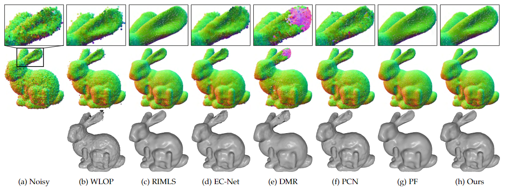

# PCDNF: Revisiting Learning-based Point Cloud Denoising via Joint Normal Filtering

:zap:`Status Update: [2023/07/02] This paper has been accepted by the IEEE Transactions on Visualization and Computer Graphics (TVCG).`

 by [Zheng Liu](https://labzhengliu.github.io/), Yaowu Zhao, Sijing Zhan, [Yuanyuan Liu](https://cvlab-liuyuanyuan.github.io/), [Renjie Chen](http://staff.ustc.edu.cn/~renjiec/) and Ying He

 ## :bulb: Introduction
Recovering high quality surfaces from noisy point clouds, known as point cloud denoising, is a fundamental yet challenging
problem in geometry processing. Most of the existing methods either directly denoise the noisy input or filter raw normals followed by
updating point positions. Motivated by the essential interplay between point cloud denoising and normal filtering, we revisit point cloud
denoising from a multitask perspective, and propose an end-to-end network, named PCDNF, to denoise point clouds via joint normal
filtering. In particular, we introduce an auxiliary normal filtering task to help the overall network remove noise more effectively while
preserving geometric features more accurately. In addition to the overall architecture, our network has two novel modules. On one
hand, to improve noise removal performance, we design a shape-aware selector to construct the latent tangent space representation of
the specific point by comprehensively considering the learned point and normal features and geometry priors. On the other hand, point
features are more suitable for describing geometric details, and normal features are more conducive for representing geometric
structures (e.g., sharp edges and corners). Combining point and normal features allows us to overcome their weaknesses. Thus, we
design a feature refinement module to fuse point and normal features for better recovering geometric information. Extensive
evaluations, comparisons, and ablation studies demonstrate that the proposed method outperforms state-of-the-arts for both point
cloud denoising and normal filtering.

The code will be released soon.
